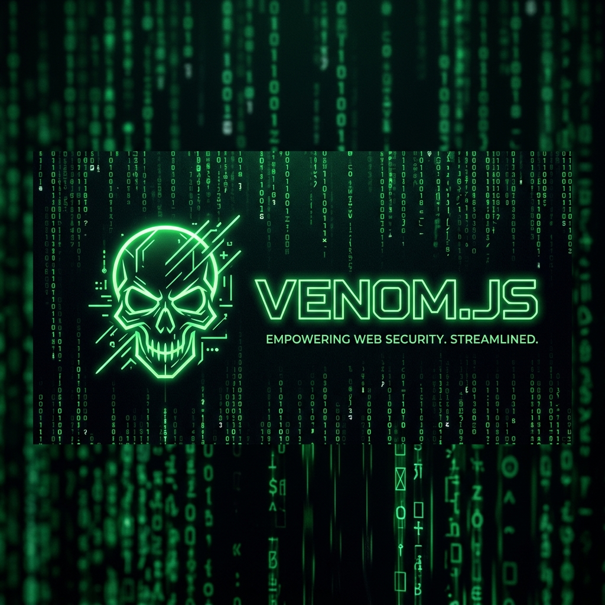
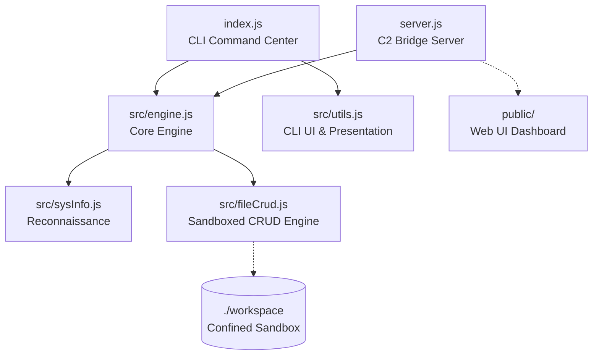
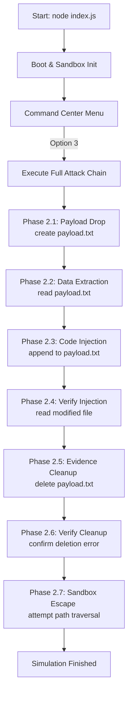
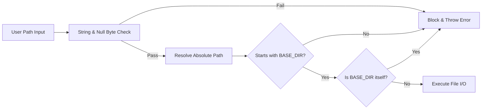

<p align="center">
  
</p>

<p align="center">
  <a href="https://nodejs.org/"></a>
  <a href="https://github.com/AbhimanyuSah-DEV/VENOM.JS"></a>
  <a href="https://github.com/AbhimanyuSah-DEV/VENOM.JS/blob/main/test.js"></a>
  <a href="https://github.com/AbhimanyuSah-DEV/VENOM.JS/blob/main/LICENSE"></a>
  
</p>

<p align="center">
  <strong>☠️ Educational Dual-Interface Virus Simulator (Reconnaissance, Payload Delivery, Code Injection, Data Exfiltration) ☠️</strong>
</p>

---

> [!WARNING]
> **EDUCATIONAL PURPOSES ONLY**  
> This software is created strictly for cybersecurity research, educational demonstrations, and hackathon presentation. It simulates common malware techniques (system fingerprinting, file manipulation, exfiltration, and cleanup) **safely confined within a sandboxed directory (`./workspace`)**. No actual harm is caused to your filesystem, and no network connections are established.

---

## 🦠 What is VENOM.JS?

Built entirely in JavaScript for the **"CREATE A VIRUS IN JS"** hackathon theme, **VENOM.JS** is a zero-dependency **Dual-Interface** application that simulates the full lifecycle of real-world malware. 

Through an interactive command-line terminal and a high-fidelity **Web Command & Control (C2) Dashboard** (featuring a Matrix digital rain canvas, CRT filters, animated boot BIOS screen, secure connection loaders, and responsive console layout), it provides a safe, hands-on look at how attackers gather host intelligence, deploy payloads, inject code, and clean up their tracks. It runs 100% locally with zero external npm packages for its simulation logic, relying only on Node.js core modules.

---

## ✨ Features

* **🌐 Dual-Interface Dashboard**: Toggle between the native console terminal and the immersive web interface. The Web UI features screen-shake/flash animations, a modal payload manager, and real-time WebSocket logs.
* **🔍 Target Reconnaissance**: Deep system fingerprinting (OS version, architecture, CPU specs, live RAM usage bar, network interfaces, and environment variables).
* **💉 Sandboxed Payload Engine**: A secure file system wrapper supporting sandboxed Create, Read, Update (inject), and Delete (CRUD) operations.
* **☠️ Automated Attack Chain**: A hands-free, 7-phase simulation showing a complete malware attack lifecycle from initial drop to self-deletion and sandbox escape testing.
* **📡 Exfiltration Engine**: Saves the collected intelligence into a timestamped JSON exfiltration report.
* **🛡️ Bulletproof Sandbox**: Confined entirely to `./workspace`. Prevents directory escapes, null-byte injection, and path traversals, verified by a custom test suite.
* **🎨 Hacker UI Toolkit**: Retro cyber-security styling built from scratch using raw ANSI escape codes (typewriter text effects, loading spinners, colored box layouts, and ASCII art).
* **🧪 52 Security Tests**: A comprehensive built-in test suite ensuring absolute safety and validating path-traversal prevention mechanisms.

---

## 🏗️ Project Architecture

```
/
├── src/
│   ├── engine.js         # ⚙️ Shared Core Engine (recon, file operations, attack chain)
│   ├── sysInfo.js        # 🔍 Reconnaissance Module (Telemetry gatherer)
│   ├── fileCrud.js       # 💉 Sandboxed Payload Engine (Path Traversal Protection)
│   └── utils.js          # 🎨 Hacker UI Toolkit (ANSI Colors, Spinners, Typewriter)
├── public/                # 🌐 Frontend Web Dashboard Assets
│   ├── index.html        # Matrix digital rain landing page
│   ├── terminal.html     # Web simulator CLI dashboard
│   ├── landing.css       # Retro green/black landing styles
│   ├── style.css         # Console dashboard styling
│   ├── landing.js        # Matrix rain, boot sequence & command links controller
│   └── app.js            # WebSocket client controller
├── workspace/             # 🔒 Isolated Sandbox (All file I/O is restricted here)
├── index.js               # ☠️ CLI Command Center (Main Entry Point)
├── server.js              # 📡 Express & WebSocket C2 Bridge Server
├── test.js                # 🧪 52-Test Security & Vulnerability Test Suite
├── package.json           # Project metadata (ES Modules config, scripts)
└── walkthrough.md         # Extended command documentation
```

### Module Separation of Concerns



---

## 🔄 Core Execution Flows

### 1. Automated Attack Chain Sequence (Option 3)
When you trigger the automated attack chain, VENOM.JS executes a full attack simulation sequence across 7 distinct phases:



### 2. The Sandbox Security Pipeline
Before any filesystem write, read, or delete takes place, the request goes through the following security checks to prevent sandbox escape:



---

## 🚀 How to Run

### 📦 Prerequisites
- **Node.js** v18.0.0 or higher is required. Check your version with:
  ```bash
  node --version
  ```
- **Zero Simulation Dependencies**: This project uses only built-in Node.js modules for all simulation code. (Express and ws are used strictly for launching the optional Web UI server).

---

### 🖥️ CLI Mode: Windows (Command Prompt - CMD)

1. Open **Command Prompt** (Press `Win + R`, type `cmd`, and press Enter).
2. Navigate to the project directory:
   ```cmd
   cd "C:\Users\user\coding\Thunder Hackathon\Thunder HAckathon 3"
   ```
   *Tip: You can also open the project directory in File Explorer, click the address bar at the top, type `cmd`, and press Enter.*
3. Launch the CLI simulator:
   ```cmd
   node index.js
   ```

---

### 🖥️ CLI Mode: Windows (PowerShell)

1. Open **PowerShell**.
2. Navigate to the directory and run the simulator:
   ```powershell
   cd "C:\Users\user\coding\Thunder Hackathon\Thunder HAckathon 3"
   node index.js
   ```

---

### 🖥️ CLI Mode: macOS / Linux (Terminal)

1. Open your terminal.
2. Run the following commands:
   ```bash
   cd "/path/to/Thunder HAckathon 3"
   node index.js
   ```

---

### 🌐 Web Dual-Interface Mode (Web C2 UI)

To run the interactive web interface dashboard:
1. In your terminal, launch the bridge server:
   ```bash
   npm run web
   ```
2. Open your web browser and navigate to:
   ```
   http://localhost:3000
   ```
3. Boot the console, and click/type `npm run web` to watch the progress loaders compile assets and transition into the visual dashboard panel (`/terminal.html`).

---

### 🧪 Running Security Tests
To run the security test suite and verify the sandbox configuration:
```bash
npm test
```
*(Or run `node test.js` directly)*

---

## 🎯 3-Minute Hackathon Demo Script (For Judges)

Use this script during your presentation to showcase the project's features and technical depth in exactly 3 minutes.

### **Minute 1: The Hook & Reconnaissance**
1. Launch the application: `node index.js`.
2. **Point out the aesthetics**: The ASCII terminal banner, typewriter loading sequences, and Matrix-green UI.
3. Select **Option 1 (Target Reconnaissance)**.
4. **Explain to the judges**: 
   > *"Before real malware acts, it gathers environment intel. Here we're reading OS info, hostnames, network MAC addresses, and environment configurations safely using Node's standard modules. The RAM usage bar updates dynamically, helping malware detect low-memory analysis sandbox environments."*

### **Minute 2: Interactive Sandbox & CRUD**
1. Select **Option 2 (Payload Operations)** to open the sub-menu.
2. Select **Option 1 (Drop Payload)**:
   - File Name: `target.txt`
   - Content: `MALWARE_PAYLOAD_INIT`
3. Select **Option 3 (Inject Code)**:
   - File Name: `target.txt`
   - Appended content: `[INJECTED_CMD_EXEC]`
4. Select **Option 2 (Extract Data)** on `target.txt` to show the injected result.
5. Select **Option 0** to return to the main menu.
6. **Explain to the judges**:
   > *"All file operations are confined within the `./workspace` directory. Any attempts to write files outside of this sandbox are intercepted by our validation engine."*

### **Minute 3: Automated Attack Chain & Security Proof**
1. Select **Option 3 (Execute Full Attack Chain)**.
2. Let the automated 7-phase sequence execute. Draw attention to the typewriter animation, the skull ASCII art, and the final Phase 2.7 where the sandbox blocks a path-traversal escape (`../../escape.txt`).
3. Select **Option 0** to exit the simulator.
4. Run the security suite in the terminal: `npm test` (or `node test.js`).
5. **Close with confidence**:
   > *"We wrote a custom test suite with 52 test cases that exhaustively probe for path traversal, null-byte bypasses, and directory boundaries. This proves we can simulate malware mechanics with zero external libraries while keeping the user's computer completely secure."*

---

## 📊 Reconnaissance Data Dictionary

VENOM.JS collects the following telemetry to simulate real malware behavior.

| Intel Collected | Node.js Core API | Real Malware Objective | Safe Simulation Behavior |
| :--- | :--- | :--- | :--- |
| **OS Type / Platform** | `os.type()` / `os.platform()` | Selecting OS-targeted payloads | Returns platform strings (`win32`, `darwin`) |
| **OS Release Version** | `os.release()` | Identifying unpatched CVE exploits | Gathers OS version numbers |
| **Hostname** | `os.hostname()` | Mapping network topology | Gathers the machine name |
| **System Uptime** | `os.uptime()` | Checking if host is a newly booted VM | Formats to readable duration (`1d 4h 3m`) |
| **CPU Spec & Cores** | `os.cpus()` / `os.arch()` | Calibrating crypto-jacking threads | Displays model name and core count |
| **Physical Memory (RAM)** | `os.totalmem()` / `os.freemem()` | Detecting sandboxes (low RAM = likely VM) | Renders free/used RAM & dynamic progress bar |
| **Network Interfaces** | `os.networkInterfaces()` | Selecting routing paths & lateral propagation | Discovers local IPv4 & MAC address |
| **Environment Variables** | `process.env` | Finding credentials, PATH variables, shells | Gathers user environment configs with fallbacks |

---

## 🛡️ Sandbox Security Guard

The simulator uses a custom verification logic `safePath()` inside [src/fileCrud.js](file:///c:/Users/user/coding/Thunder%20Hackathon/Thunder%20HAckathon%203/src/fileCrud.js) to enforce boundary safety.

### 52-Test Security Breakdown
To verify security robustness, the project includes an independent testing suite that covers:
* **Path Traversal Attacks (11 Tests)**: Validates that entries like `../file.txt`, `..\..\window`, and absolute root paths are blocked.
* **Null Byte Injection (1 Test)**: Checks that filenames like `filename\0.txt` are caught before execution.
* **CRUD Mechanics (17 Tests)**: Confirms correct file creations, appends, listing, updates, and idempotent deletions under various string lengths.
* **Input Validation (4 Tests)**: Ensures empty strings, white spaces, and invalid object types fail gracefully.
* **Telemetry Verification (7 Tests)**: Assures target reconnaissance fields remain complete and formatted correctly.
* **Utility Reliability (9 Tests)**: Validates helper functions such as ANSI-stripping, progress-bar clamping, and uptime formatting.

---

## 🛠️ Technology Stack
* **Runtime Platform**: Node.js (v18.0.0+)
* **Language Specification**: ES6+ JavaScript (configured as ES Modules)
* **Dependencies**: `0` (Zero external packages, eliminating supply-chain exploits)
* **Testing Engine**: Built-in test runner (`test.js`)
* **Styling**: ANSI Escape Codes (custom theme layer, avoiding libraries like `chalk` or `ora`)

---

## 🚀 Future Roadmap & Extensions

While currently complete, VENOM.JS is designed to support future malware simulation modules:
1. **Ransomware simulation**: Confined file encryption and decryption using the Node.js `crypto` module.
2. **Process Reconnaissance**: Scanning active tasks/processes via `child_process.exec` commands.
3. **Registry/Cron Persistence**: Simulating how malware establishes persistence on startup.

---

## 📜 License
MIT — Distributed for educational and cybersecurity training purposes only.
