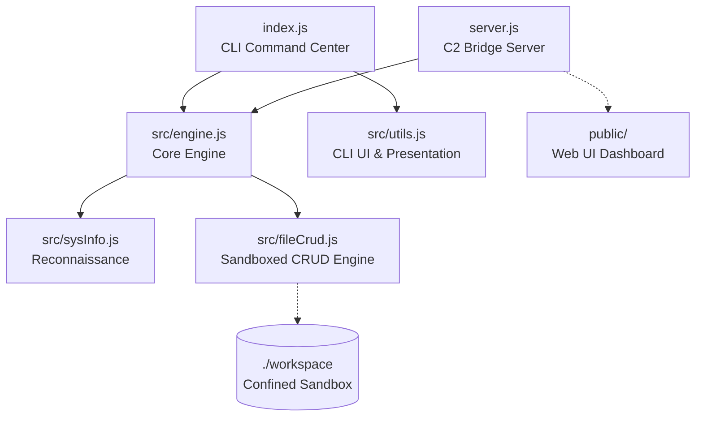
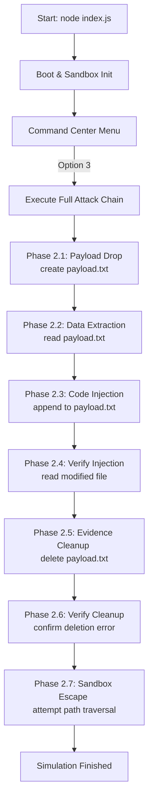
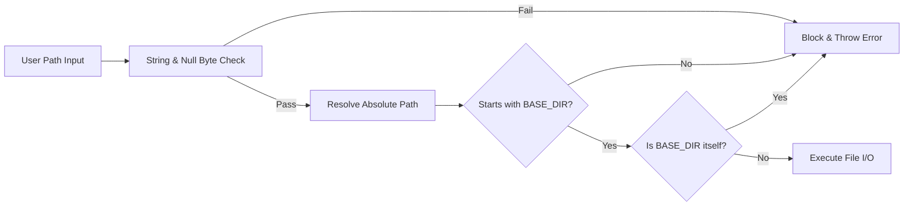

<p align="center">
  
</p>

<p align="center">
  <a href="https://nodejs.org/"></a>
  <a href="https://github.com/AbhimanyuSah-DEV/VENOM.JS"></a>
  <a href="https://github.com/AbhimanyuSah-DEV/VENOM.JS/blob/main/test.js"></a>
  <a href="https://github.com/AbhimanyuSah-DEV/VENOM.JS/blob/main/LICENSE"></a>
  
</p>

<p align="center">
  <strong>☠️ Educational Dual-Interface Virus Simulator (Reconnaissance, Payload Delivery, Code Injection, Data Exfiltration) ☠️</strong>
</p>

---

> [!WARNING]
> **EDUCATIONAL PURPOSES ONLY**  
> This software is created strictly for cybersecurity research, educational demonstrations, and hackathon presentation. It simulates common malware techniques (system fingerprinting, file manipulation, exfiltration, and cleanup) **safely confined within a sandboxed directory (`./workspace`)**. No actual harm is caused to your filesystem, and no network connections are established.

---

## 🦠 What is VENOM.JS?

Built entirely in JavaScript for the **"CREATE A VIRUS IN JS"** hackathon challenge, **VENOM.JS** directly fulfils the core objective:

> *Build a JavaScript-based tool that gathers and displays system information and environment variables and can do CRUD operations on other code files.*

It is a zero-dependency **Dual-Interface** application that simulates the full lifecycle of real-world malware — from reconnaissance and payload delivery to code injection and data exfiltration — all safely sandboxed and built entirely with Node.js built-in modules.

---

## 🎯 Hackathon Objective Coverage

| Requirement | How VENOM.JS Fulfils It |
| :--- | :--- |
| Gather OS details | `os.type()`, `os.platform()`, `os.release()`, `os.arch()` in `src/sysInfo.js` |
| CPU Architecture | `os.cpus()` and `os.arch()` return model, core count, and speed |
| Hostname | `os.hostname()` — simulates network topology fingerprinting |
| Node.js Version | `process.version` — used to detect vulnerable runtime environments |
| Platform Information | `os.platform()` — selects OS-specific attack payloads |
| User Home Directory | `os.homedir()` — locates user data and credential stores |
| Environment Variables | `process.env` with graceful fallbacks for `PATH`, `USER`, `SHELL`, `HOME`, `LANG`, `TERM` |
| Structured Output | JSON-serializable objects, ANSI-formatted tables, and a live RAM progress bar |
| Missing Value Handling | All fields use `\|\|` fallback chains — app never crashes on undefined env vars |
| CRUD Operations | Full Create, Read, Update (inject), Delete on sandboxed files in `src/fileCrud.js` |
| Clear Documentation | This `readme.md` + inline JSDoc comments on every function in `src/` |

---

## ✨ Features

* **🌐 Dual-Interface Dashboard**: Toggle between the native console terminal and the immersive web interface. The Web UI features screen-shake/flash animations, a modal payload manager, and real-time WebSocket logs.
* **🔍 Target Reconnaissance**: Deep system fingerprinting (OS version, architecture, CPU specs, live RAM usage bar, network interfaces, and environment variables).
* **💉 Sandboxed Payload Engine**: A secure file system wrapper supporting sandboxed Create, Read, Update (inject), and Delete (CRUD) operations.
* **☠️ Automated Attack Chain**: A hands-free, 7-phase simulation showing a complete malware attack lifecycle from initial drop to self-deletion and sandbox escape testing.
* **📡 Exfiltration Engine**: Saves the collected intelligence into a timestamped JSON exfiltration report.
* **🛡️ Bulletproof Sandbox**: Confined entirely to `./workspace`. Prevents directory escapes, null-byte injection, and path traversals, verified by a custom test suite.
* **🎨 Hacker UI Toolkit**: Retro cyber-security styling built from scratch using raw ANSI escape codes (typewriter text effects, loading spinners, colored box layouts, and ASCII art).
* **🧪 52 Security Tests**: A comprehensive built-in test suite ensuring absolute safety and validating path-traversal prevention mechanisms.

---

## 🏗️ Project Architecture

```
/
├── src/
│   ├── engine.js         # ⚙️ Shared Core Engine (recon, file operations, attack chain)
│   ├── sysInfo.js        # 🔍 Reconnaissance Module (Telemetry gatherer)
│   ├── fileCrud.js       # 💉 Sandboxed Payload Engine (Path Traversal Protection)
│   └── utils.js          # 🎨 Hacker UI Toolkit (ANSI Colors, Spinners, Typewriter)
├── public/                # 🌐 Frontend Web Dashboard Assets
│   ├── index.html        # Matrix digital rain landing page
│   ├── terminal.html     # Web simulator CLI dashboard
│   ├── landing.css       # Retro green/black landing styles
│   ├── style.css         # Console dashboard styling
│   ├── landing.js        # Matrix rain, boot sequence & command links controller
│   └── app.js            # WebSocket client controller
├── workspace/             # 🔒 Isolated Sandbox (All file I/O is restricted here)
├── index.js               # ☠️ CLI Command Center (Main Entry Point)
├── server.js              # 📡 Express & WebSocket C2 Bridge Server
├── test.js                # 🧪 52-Test Security & Vulnerability Test Suite
├── package.json           # Project metadata (ES Modules config, scripts)
└── walkthrough.md         # Extended command documentation
```

### Module Separation of Concerns



---

## 🧠 Code Flow & Strategy

This section directly fulfils the hackathon requirement: *"You must specify your code flow and strategy in `readme.md`"*.

### Strategy: Layered Separation of Concerns

VENOM.JS is split into three distinct layers, each with a single responsibility:

```
┌─────────────────────────────────────────────────────────────────┐
│  PRESENTATION LAYER (index.js + public/)                        │
│  Handles all user I/O: menus, ANSI colors, typewriter effects,  │
│  web UI events, WebSocket rendering. No business logic here.    │
├─────────────────────────────────────────────────────────────────┤
│  ENGINE LAYER (src/engine.js)                                   │
│  Orchestrates operations. Returns pure JSON-serializable data.  │
│  Zero console.log calls — this layer is fully testable.         │
├─────────────────────────────────────────────────────────────────┤
│  DATA LAYER (src/sysInfo.js + src/fileCrud.js)                  │
│  Raw data gathering and file I/O with security validation.      │
│  Each function is atomic, predictable, and side-effect-free.    │
└─────────────────────────────────────────────────────────────────┘
```

### Step-by-Step Code Flow: Reconnaissance (Option 1)

```
1. User selects Option 1 in the CLI menu (index.js)
   │
   ▼
2. index.js calls engine.runRecon() from src/engine.js
   │
   ▼
3. engine.runRecon() calls getSystemTelemetry() from src/sysInfo.js
   │
   ├─► os.type() / os.platform() / os.release()   → system fingerprint
   ├─► os.arch() / os.cpus()                       → CPU profile
   ├─► os.totalmem() / os.freemem()                → RAM usage (with % bar)
   ├─► os.networkInterfaces()                      → filtered IPv4 + MAC
   └─► process.env.PATH / USER / SHELL / HOME…    → env vars (with fallbacks)
   │
   ▼
4. Returns a structured JSON object to engine.js, then to index.js
   │
   ▼
5. index.js formats and prints with ANSI styling via src/utils.js
   (or server.js broadcasts it as a WebSocket JSON message to the browser)
```

### Step-by-Step Code Flow: CRUD Operations (Option 2)

```
1. User selects a CRUD sub-option (index.js) and provides filename + content
   │
   ▼
2. index.js calls the matching engine function:
   dropPayload()  → createFile()   (CREATE)
   extractData()  → readFile()     (READ)
   injectCode()   → updateFile()   (UPDATE / Append)
   destroyEvidence() → deleteFile() (DELETE)
   │
   ▼
3. All paths pass through safePath() in src/fileCrud.js:
   ├─► Rejects empty or non-string filenames  (VALIDATION error)
   ├─► Rejects null-byte injection \0          (SECURITY error)
   ├─► Resolves absolute path with path.resolve()
   ├─► Blocks any path not starting with BASE_DIR  (TRAVERSAL blocked)
   └─► Blocks the BASE_DIR itself (prevents directory-as-file access)
   │
   ▼
4. If safe → executes fs.writeFileSync / readFileSync / appendFileSync / unlinkSync
   │
   ▼
5. Returns { success, operation, filename, size, message } JSON result
   │
   ▼
6. Presentation layer renders the result with appropriate ANSI color coding
```

---

## 🔄 Core Execution Flows

### 1. Automated Attack Chain Sequence (Option 3)
When you trigger the automated attack chain, VENOM.JS executes a full attack simulation sequence across 7 distinct phases:



### 2. The Sandbox Security Pipeline
Before any filesystem write, read, or delete takes place, the request goes through the following security checks to prevent sandbox escape:



---

## 🚀 How to Run

### 📦 Prerequisites
- **Node.js** v18.0.0 or higher is required. Check your version with:
  ```bash
  node --version
  ```
- **Zero Simulation Dependencies**: This project uses only built-in Node.js modules for all simulation code. (Express and ws are used strictly for launching the optional Web UI server).

---

### 🖥️ CLI Mode: Windows (Command Prompt - CMD)

1. Open **Command Prompt** (Press `Win + R`, type `cmd`, and press Enter).
2. Navigate to the project directory:
   ```cmd
   cd "C:\Users\user\coding\Thunder Hackathon\Thunder HAckathon 3"
   ```
   *Tip: You can also open the project directory in File Explorer, click the address bar at the top, type `cmd`, and press Enter.*
3. Launch the CLI simulator:
   ```cmd
   node index.js
   ```

---

### 🖥️ CLI Mode: Windows (PowerShell)

1. Open **PowerShell**.
2. Navigate to the directory and run the simulator:
   ```powershell
   cd "C:\Users\user\coding\Thunder Hackathon\Thunder HAckathon 3"
   node index.js
   ```

---

### 🖥️ CLI Mode: macOS / Linux (Terminal)

1. Open your terminal.
2. Run the following commands:
   ```bash
   cd "/path/to/Thunder HAckathon 3"
   node index.js
   ```

---

### 🌐 Web Dual-Interface Mode (Web C2 UI)

To run the interactive web interface dashboard:
1. In your terminal, launch the bridge server:
   ```bash
   npm run web
   ```
2. Open your web browser and navigate to:
   ```
   http://localhost:3000
   ```
3. Boot the console, and click/type `npm run web` to watch the progress loaders compile assets and transition into the visual dashboard panel (`/terminal.html`).

---

### 🧪 Running Security Tests
To run the security test suite and verify the sandbox configuration:
```bash
npm test
```
*(Or run `node test.js` directly)*

---

## 🎯 3-Minute Hackathon Demo Script (For Judges)

Use this script during your presentation to showcase the project's features and technical depth in exactly 3 minutes.

### **Minute 1: The Hook & Reconnaissance**
1. Launch the application: `node index.js`.
2. **Point out the aesthetics**: The ASCII terminal banner, typewriter loading sequences, and Matrix-green UI.
3. Select **Option 1 (Target Reconnaissance)**.
4. **Explain to the judges**: 
   > *"Before real malware acts, it gathers environment intel. Here we're reading OS info, hostnames, network MAC addresses, and environment configurations safely using Node's standard modules. The RAM usage bar updates dynamically, helping malware detect low-memory analysis sandbox environments."*

### **Minute 2: Interactive Sandbox & CRUD**
1. Select **Option 2 (Payload Operations)** to open the sub-menu.
2. Select **Option 1 (Drop Payload)**:
   - File Name: `target.txt`
   - Content: `MALWARE_PAYLOAD_INIT`
3. Select **Option 3 (Inject Code)**:
   - File Name: `target.txt`
   - Appended content: `[INJECTED_CMD_EXEC]`
4. Select **Option 2 (Extract Data)** on `target.txt` to show the injected result.
5. Select **Option 0** to return to the main menu.
6. **Explain to the judges**:
   > *"All file operations are confined within the `./workspace` directory. Any attempts to write files outside of this sandbox are intercepted by our validation engine."*

### **Minute 3: Automated Attack Chain & Security Proof**
1. Select **Option 3 (Execute Full Attack Chain)**.
2. Let the automated 7-phase sequence execute. Draw attention to the typewriter animation, the skull ASCII art, and the final Phase 2.7 where the sandbox blocks a path-traversal escape (`../../escape.txt`).
3. Select **Option 0** to exit the simulator.
4. Run the security suite in the terminal: `npm test` (or `node test.js`).
5. **Close with confidence**:
   > *"We wrote a custom test suite with 52 test cases that exhaustively probe for path traversal, null-byte bypasses, and directory boundaries. This proves we can simulate malware mechanics with zero external libraries while keeping the user's computer completely secure."*

---

## 📊 Reconnaissance Data Dictionary

VENOM.JS collects the following telemetry using **only Node.js built-in modules**, directly satisfying the hackathon's data collection requirements:

| Data Point | Node.js API | Field in Output | Error Fallback |
| :--- | :--- | :--- | :--- |
| **Operating System** | `os.type()` | `system.osType` | Always returns string |
| **Platform** | `os.platform()` | `system.osPlatform` | Always returns string |
| **OS Release Version** | `os.release()` | `system.osRelease` | Always returns string |
| **CPU Architecture** | `os.arch()` | `system.cpuArchitecture` | Always returns string |
| **Hostname** | `os.hostname()` | `system.hostname` | Always returns string |
| **Node.js Version** | `process.version` | `system.nodeVersion` | Always returns string |
| **User Home Directory** | `os.homedir()` | `system.userHomeDir` | Always returns string |
| **System Uptime** | `os.uptime()` | `system.uptime` | Formatted as `2d 5h 32m 10s` |
| **CPU Model & Cores** | `os.cpus()` | `cpu.model`, `cpu.cores` | Falls back to `'Not Available'` if no CPUs |
| **CPU Speed** | `os.cpus()[0].speed` | `cpu.speed` | Falls back to `'Not Available'` |
| **Total RAM** | `os.totalmem()` | `memory.total` | Formatted as `16.00 GB` |
| **Free / Used RAM** | `os.freemem()` | `memory.free`, `memory.used` | Computed, always valid |
| **RAM Usage %** | Computed | `memory.usagePercent` | Clamped 0–100 |
| **Network Interfaces** | `os.networkInterfaces()` | `network[].interface` | Falls back to `'Not Available'` |
| **IPv4 Address** | `os.networkInterfaces()` | `network[].address` | Filtered to non-internal only |
| **MAC Address** | `os.networkInterfaces()` | `network[].mac` | Included per interface |
| **PATH Variable** | `process.env.PATH` | `environment.PATH` | `\|\|` fallback: `'Not Available'` |
| **Current User** | `process.env.USER` or `USERNAME` | `environment.USER` | Cross-platform fallback chain |
| **Shell** | `process.env.SHELL` or `ComSpec` | `environment.SHELL` | Cross-platform fallback chain |
| **Language** | `process.env.LANG` | `environment.LANG` | `\|\|` fallback: `'Not Available'` |
| **Home Directory** | `process.env.HOME` or `USERPROFILE` | `environment.HOME` | Cross-platform fallback chain |
| **Terminal Type** | `process.env.TERM` | `environment.TERM` | `\|\|` fallback: `'Not Available'` |
| **Node Environment** | `process.env.NODE_ENV` | `environment.NODE_ENV` | `\|\|` fallback: `'Not Available'` |

---

## 🛡️ Error Handling

All error handling in VENOM.JS is **explicit, typed, and graceful** — the app never crashes on bad input or missing system data.

### 1. Reconnaissance (sysInfo.js) — Missing Values
All environment variable lookups use chained `||` fallback guards:
```js
// Cross-platform USER detection — works on Windows (USERNAME) and Unix (USER)
USER: process.env.USER || process.env.USERNAME || 'Not Available'

// Cross-platform SHELL detection — cmd.exe on Windows, bash/zsh on Unix
SHELL: process.env.SHELL || process.env.ComSpec || 'Not Available'
```
This means the app **can never throw a TypeError** from an undefined environment variable, even in restricted cloud environments.

### 2. CRUD Operations (fileCrud.js) — Typed Error Objects
Every file operation returns a structured result object instead of throwing raw exceptions:
```js
// Example: reading a non-existent file
{ success: false, operation: 'READ', error: 'ENOENT', message: 'File not found: target.txt' }

// Example: path traversal attempt blocked
{ success: false, operation: 'VALIDATION', error: 'PATH_TRAVERSAL', message: 'Access denied: path outside sandbox' }
```
This means **callers never need try/catch** — they just check `result.success`.

### 3. safePath() — Security Validation Pipeline
The `safePath()` function in `src/fileCrud.js` enforces all boundary checks:
```
Input → String type check → Null byte (\0) check → path.resolve() 
     → Must start with BASE_DIR → Must not equal BASE_DIR → Permitted ✔
```

### 52-Test Security Breakdown
To verify security robustness, the project includes an independent testing suite covering:
* **Path Traversal Attacks (11 Tests)**: Validates that entries like `../file.txt`, `..\..\window`, and absolute root paths are blocked.
* **Null Byte Injection (1 Test)**: Checks that filenames like `filename\0.txt` are caught before execution.
* **CRUD Mechanics (17 Tests)**: Confirms correct file creations, appends, listing, updates, and idempotent deletions.
* **Input Validation (4 Tests)**: Ensures empty strings, white spaces, and invalid object types fail gracefully.
* **Telemetry Verification (7 Tests)**: Assures all reconnaissance fields are present, correctly typed, and non-empty.
* **Utility Reliability (9 Tests)**: Validates helper functions such as ANSI-stripping, progress-bar clamping, and uptime formatting.

---

## 🖥️ Output Formatting

VENOM.JS outputs all collected data in **two structured formats simultaneously**, satisfying the hackathon's output formatting requirement:

### Format 1: CLI — Structured ANSI Console Output
The CLI renders data in a boxed, color-coded layout using raw ANSI escape codes built in `src/utils.js`:
```
  [RECON] Target Fingerprint

  OS Type             Windows_NT
  Platform            win32
  OS Release          10.0.26200
  CPU Architecture    x64
  Hostname            DESKTOP-XYZ
  Node.js Version     v24.11.1
  Home Directory      C:\Users\user
  System Uptime       2d 14h 42m 19s

  [CPU] Processor Intel
  Model               Intel(R) Core(TM) i7-13700H @ 2.40GHz
  Logical Cores       14
  Base Speed          2400 MHz

  [MEMORY] RAM Mapping
  Total               16.00 GB
  Used                10.88 GB    ██████████████████░░░░░ 68.1%
  Free                5.12 GB

  [NETWORK] Network Interfaces
  Interface           Wi-Fi
  IPv4 Address        192.168.1.104
  MAC Address         70:bc:10:8d:fa:21

  [ENV] Environment Variables Harvested
  PATH                C:\Windows\system32;...
  USER                user
  SHELL               C:\Windows\system32\cmd.exe
```

### Format 2: JSON — Structured Exfiltration Report (Option 4)
Running Option 4 (Exfiltrate Data) writes all telemetry to a machine-readable JSON file:
```json
{
  "timestamp": "2026-06-21T08:54:45.117Z",
  "system": { "osType": "Windows_NT", "hostname": "DESKTOP-XYZ", "nodeVersion": "v24.11.1" },
  "cpu": { "model": "Intel Core i7-13700H", "cores": 14, "speed": "2400 MHz" },
  "memory": { "total": "16.00 GB", "used": "10.88 GB", "usagePercent": 68.1 },
  "network": [{ "interface": "Wi-Fi", "address": "192.168.1.104", "mac": "70:bc:10:8d:fa:21" }],
  "environment": { "USER": "user", "SHELL": "cmd.exe", "PATH": "C:\\Windows\\system32;..." }
}
```
The file is saved as `workspace/exfil-report-<timestamp>.json` and can be opened or piped into any JSON viewer.

---

## 🛠️ Technology Stack
* **Runtime Platform**: Node.js (v18.0.0+)
* **Language Specification**: ES6+ JavaScript (configured as ES Modules)
* **Dependencies**: `0` (Zero external packages, eliminating supply-chain exploits)
* **Testing Engine**: Built-in test runner (`test.js`)
* **Styling**: ANSI Escape Codes (custom theme layer, avoiding libraries like `chalk` or `ora`)

---

## 🚀 Future Roadmap & Extensions

While currently complete, VENOM.JS is designed to support future malware simulation modules:
1. **Ransomware simulation**: Confined file encryption and decryption using the Node.js `crypto` module.
2. **Process Reconnaissance**: Scanning active tasks/processes via `child_process.exec` commands.
3. **Registry/Cron Persistence**: Simulating how malware establishes persistence on startup.

---

## 📜 License
MIT — Distributed for educational and cybersecurity training purposes only.
